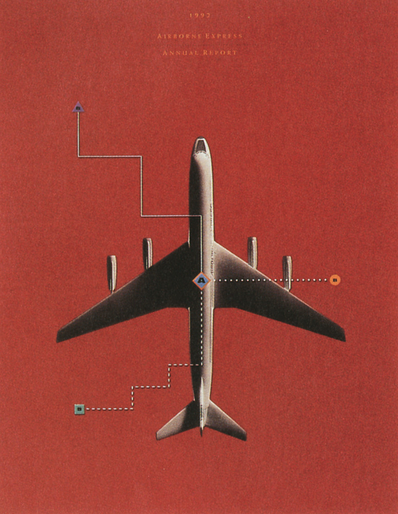

# Airborne Express 1992

## Onderbouwing keuze
Vliegen zit bij mij in de familie, mijn vader zit in de luchtvaart. Dit is dan ook de reden dat ik voor het kunstwerk *Airborne Express 1992 Annual Report* heb gekozen. In dit kunstwerk zag ik allerlei mogelijkheden om in een animatie te kunnen verwerken. Het origineel heeft een oude look and feel en deze wilde ik er inhouden. Dit heb ik kunnen doen door een grijs-achtige overlay er over heen te kunnen zetten.

## Geschiedenis
Airborne Express was een bezorg- en vrachtluchtvaartmaatschappij. Het hoofdkantoor zit gevestigd in Seattle, Washington, maar ze komen oorspronkelijk uit Wilmington, Ohio. Airborne is ontstaan als de Airborn Flower Traffic Association van Californië in 1946 om bloemen van Hawaii naar het vasteland van de Verenigde Staten te vliegen. Later, in 2003, werd de Airborne Express verworven in DHL. Het werd de derde grootste privé bezorgmaatschappij van de Verenigde Staten.

### Waarom 1992?
Op 6 maart 1992 was een NAMC YS-11A een trainingsvlucht aan het doen en kregen ze schade. Deze was niet meer te herstellen doordat ze een buiklanding hebben moeten maken in het Wilmington-Airnorne Airpark doordat de crew per ongeluk het onderste landingsgestel vergeten waren. De drie crewleden overleefden het wel.

## Ontwerp

## Uitwerking
